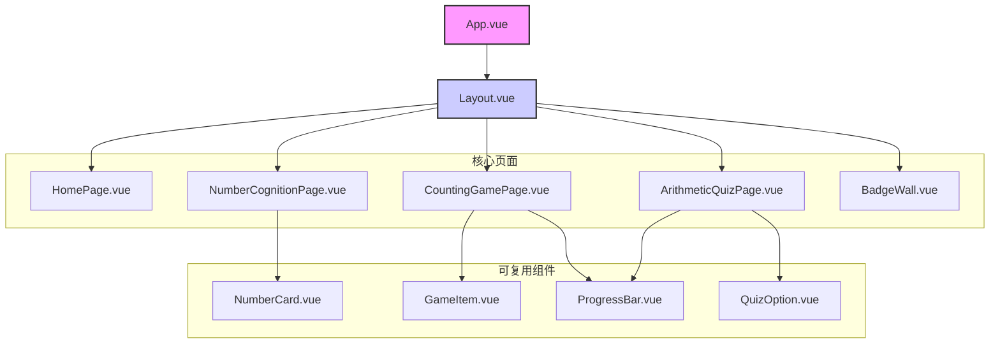

# “数字乐园” (Number Paradise) 开发蓝图

本文档为“数字乐园”儿童数字学习Web应用的完整开发蓝图，旨在为项目从初始化到部署的全过程提供清晰、可执行的指导。

## 一、项目核心设定

*   **项目名称：** 数字乐园 (Number Paradise)
*   **前端框架：** Vue 3 (使用 Vite)
*   **UI组件库：** TDesign Vue Next
*   **状态管理：** Pinia
*   **样式方案：** Tailwind CSS
*   **部署架构：** GitHub + Cloudflare Pages

---

## 二、阶段一：项目初始化与环境搭建

### 1. 命令行指令

**A. 创建项目**
```bash
# 使用Vite创建基于Vue和TypeScript的项目
npm create vite@latest number-paradise -- --template vue-ts
cd number-paradise
```

**B. 安装核心依赖**
```bash
# 安装TDesign, Pinia, 和 TailwindCSS 相关包
npm install tdesign-vue-next@latest pinia@latest tailwindcss@latest postcss@latest autoprefixer@latest
```

**C. 安装开发依赖**
```bash
# 安装ESLint, Prettier 及相关插件
npm install -D eslint prettier eslint-plugin-vue @typescript-eslint/parser @typescript-eslint/eslint-plugin @vue/eslint-config-prettier @vue/eslint-config-typescript prettier-plugin-tailwindcss
```

**D. 初始化 Tailwind CSS**
```bash
# 此命令会生成 tailwindcss.config.js 和 postcss.config.js 文件
npx tailwindcss init -p
```

### 2. `package.json` 核心内容

以下是配置完成后 `package.json` 中 `dependencies` 和 `devDependencies` 的一个示例。

```json
{
  "dependencies": {
    "autoprefixer": "^10.4.19",
    "pinia": "^2.1.7",
    "postcss": "^8.4.38",
    "tailwindcss": "^3.4.3",
    "tdesign-vue-next": "^1.9.4",
    "vue": "^3.4.21"
  },
  "devDependencies": {
    "@typescript-eslint/eslint-plugin": "^7.8.0",
    "@typescript-eslint/parser": "^7.8.0",
    "@vitejs/plugin-vue": "^5.0.4",
    "@vue/eslint-config-prettier": "^9.0.0",
    "@vue/eslint-config-typescript": "^13.0.0",
    "eslint": "^8.57.0",
    "eslint-plugin-vue": "^9.26.0",
    "prettier": "^3.2.5",
    "prettier-plugin-tailwindcss": "^0.5.14",
    "typescript": "^5.2.2",
    "vite": "^5.2.0"
  }
}
```

### 3. 推荐配置文件

**A. `.eslintrc.cjs`**
```javascript
/* eslint-env node */
module.exports = {
  root: true,
  'extends': [
    'plugin:vue/vue3-essential',
    'eslint:recommended',
    '@vue/eslint-config-typescript',
    '@vue/eslint-config-prettier/skip-formatting'
  ],
  parserOptions: {
    ecmaVersion: 'latest'
  }
}
```

**B. `.prettierrc.json`**
```json
{
  "semi": false,
  "singleQuote": true,
  "plugins": ["prettier-plugin-tailwindcss"]
}
```

---

## 三、阶段二：项目结构与组件设计

### 1. 推荐目录结构

```
number-paradise/
├── public/
├── src/
│   ├── assets/         # 存放图片、字体等静态资源
│   │   └── images/
│   ├── components/     # 全局可复用组件
│   │   ├── NumberCard.vue
│   │   ├── GameItem.vue
│   │   ├── QuizOption.vue
│   │   └── ProgressBar.vue
│   ├── pages/          # 页面级组件
│   │   ├── HomePage.vue
│   │   ├── NumberCognitionPage.vue
│   │   ├── CountingGamePage.vue
│   │   ├── ArithmeticQuizPage.vue
│   │   └── BadgeWall.vue
│   ├── router/         # Vue Router配置
│   │   └── index.ts
│   ├── store/          # Pinia状态管理
│   │   └── game.ts
│   ├── styles/         # 全局样式及Tailwind入口
│   │   └── main.css
│   ├── App.vue         # 根组件
│   ├── main.ts         # 应用入口
│   └── Layout.vue      # 主布局组件
└── ... (其他配置文件)
```

### 2. 核心组件层级



### 3. `<CountingGamePage.vue>` 高质量代码示例

此示例展示了如何结合 Vue 3 `<script setup>`, Pinia, 和 Tailwind CSS 来创建一个核心交互页面。

```vue
<!-- src/pages/CountingGamePage.vue -->
<template>
  <div class="flex h-screen w-full items-center justify-center bg-blue-100 font-sans">
    <div class="w-full max-w-2xl rounded-2xl bg-white p-8 shadow-lg transition-transform hover:scale-105">
      <!-- 游戏标题 -->
      <h1 class="mb-4 text-center text-4xl font-bold text-blue-600">数一数有多少个 🍎？</h1>

      <!-- 游戏区域 -->
      <div class="my-8 grid min-h-[200px] grid-cols-5 gap-4 rounded-lg bg-gray-50 p-6">
        <div v-for="n in itemsToCount" :key="n" class="flex animate-bounce items-center justify-center text-5xl">
          🍎
        </div>
      </div>

      <!-- 答案选择区域 -->
      <div class="mb-6 flex justify-center space-x-4">
        <button
          v-for="option in answerOptions"
          :key="option"
          @click="selectAnswer(option)"
          :class="[
            'flex h-16 w-16 items-center justify-center rounded-full text-2xl font-bold text-white shadow-md transition-all',
            selectedAnswer === option ? 'scale-110 ring-4 ring-yellow-400' : '',
            'bg-green-500 hover:bg-green-600'
          ]"
        >
          {{ option }}
        </button>
      </div>

      <!-- 操作与反馈 -->
      <div class="text-center">
        <button
          @click="checkAnswer"
          class="rounded-lg bg-blue-500 px-8 py-3 text-xl font-semibold text-white shadow-sm transition-transform hover:scale-105 disabled:cursor-not-allowed disabled:bg-gray-400"
          :disabled="selectedAnswer === null"
        >
          检查答案
        </button>
        <p v-if="feedbackMessage" class="mt-4 text-2xl font-semibold" :class="isCorrect ? 'text-green-500' : 'text-red-500'">
          {{ feedbackMessage }}
        </p>
      </div>
    </div>
  </div>
</template>

<script setup lang="ts">
import { ref, onMounted } from 'vue'
import { useGameStore } from '../store/game'

// 使用Pinia Store
const gameStore = useGameStore()

// 组件内部状态
const itemsToCount = ref(0)
const answerOptions = ref<number[]>([])
const selectedAnswer = ref<number | null>(null)
const feedbackMessage = ref('')
const isCorrect = ref(false)

// 生成新游戏
const setupNewGame = () => {
  // 实际数量 (例如，3到8之间)
  const actualCount = Math.floor(Math.random() * 6) + 3
  itemsToCount.value = actualCount

  // 生成答案选项
  const options = new Set<number>()
  options.add(actualCount)
  while (options.size < 4) {
    const randomOption = Math.max(1, actualCount + Math.floor(Math.random() * 5) - 2)
    options.add(randomOption)
  }
  answerOptions.value = Array.from(options).sort((a, b) => a - b)

  // 重置状态
  selectedAnswer.value = null
  feedbackMessage.value = ''
  isCorrect.value = false
}

// 选择答案
const selectAnswer = (option: number) => {
  selectedAnswer.value = option
}

// 检查答案
const checkAnswer = () => {
  if (selectedAnswer.value === null) return

  if (selectedAnswer.value === itemsToCount.value) {
    feedbackMessage.value = '太棒了，完全正确！'
    isCorrect.value = true
    gameStore.incrementScore(10) // 答对加10分
    // 延迟1.5秒开始新游戏
    setTimeout(setupNewGame, 1500)
  } else {
    feedbackMessage.value = '哎呀，再试一次吧！'
    isCorrect.value = false
  }
}

// 组件挂载时开始第一局游戏
onMounted(() => {
  setupNewGame()
})
</script>
```

---

## 四、阶段三：核心功能逻辑实现

### 1. Pinia Store 示例 (`src/store/game.ts`)

```typescript
import { defineStore } from 'pinia'

export const useGameStore = defineStore('game', {
  state: () => ({
    currentScore: 0,
    badges: [] as string[],
    level: 1,
  }),

  getters: {
    badgeCount: (state) => state.badges.length,
    canLevelUp: (state) => state.currentScore > state.level * 100,
  },

  actions: {
    incrementScore(points: number) {
      this.currentScore += points
    },
    addBadge(badgeName: string) {
      if (!this.badges.includes(badgeName)) {
        this.badges.push(badgeName)
      }
    },
    levelUp() {
      if (this.canLevelUp) {
        this.level++
        this.addBadge(`等级 ${this.level} 大师`)
      }
    },
    resetGame() {
      this.currentScore = 0
      this.badges = []
      this.level = 1
    },
  },
})
```

### 2. 核心游戏逻辑函数示例 (`src/utils/gameLogic.ts`)

```typescript
interface GameItem {
  name: string;
  emoji: string;
}

const ITEM_POOL: GameItem[] = [
  { name: '苹果', emoji: '🍎' },
  { name: '香蕉', emoji: '🍌' },
  { name: '星星', emoji: '⭐' },
  { name: '气球', emoji: '🎈' },
  { name: '小汽车', emoji: '🚗' },
];

/**
 * 生成一个数数游戏题目
 * @param level 当前游戏难度等级
 * @returns 包含题目信息的对象
 */
export function generateCountingGame(level: number) {
  const maxCount = 5 + level * 2;
  const minCount = 1 + level;
  
  const randomItem = ITEM_POOL[Math.floor(Math.random() * ITEM_POOL.length)];
  const correctCount = Math.floor(Math.random() * (maxCount - minCount + 1)) + minCount;
  
  const options = new Set<number>();
  options.add(correctCount);
  while (options.size < 4) {
    const randomOffset = Math.floor(Math.random() * 5) - 2;
    const randomOption = Math.max(1, correctCount + randomOffset);
    options.add(randomOption);
  }
  
  return {
    item: randomItem,
    count: correctCount,
    options: Array.from(options).sort((a, b) => a - b),
  };
}
```

---

## 五、阶段四：部署与持续集成

### 1. 初始化Git并推送到GitHub

1.  **初始化本地仓库**
    ```bash
    git init
    git add .
    git commit -m "🎉 Initial commit: Setup project structure and dependencies"
    ```
2.  **在GitHub创建新仓库**
    访问 [GitHub](https://github.com/new) 并创建一个新的空仓库 (例如 `number-paradise`)。

3.  **关联并推送**
    ```bash
    # 将 <YOUR_GITHUB_USERNAME> 替换为你的GitHub用户名
    git remote add origin https://github.com/<YOUR_GITHUB_USERNAME>/number-paradise.git
    git branch -M main
    git push -u origin main
    ```

### 2. 在Cloudflare Pages上部署

1.  **登录Cloudflare** 并导航至 **Workers & Pages**。
2.  点击 **Create application** > **Pages** > **Connect to Git**。
3.  授权并选择你的 `number-paradise` GitHub仓库。
4.  在 **Set up builds and deployments** 页面，确认以下配置：
    *   **Framework preset:** `Vite`
    *   **Build command:** `npm run build`
    *   **Build output directory:** `dist`
5.  点击 **Save and Deploy**。

部署完成后，你的应用将通过一个 `*.pages.dev` 域名全球可用。后续推送到 `main` 分支将触发自动更新。
